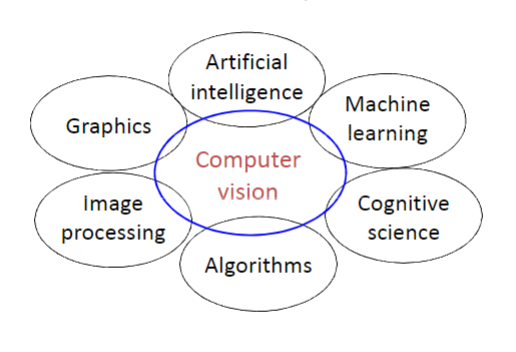
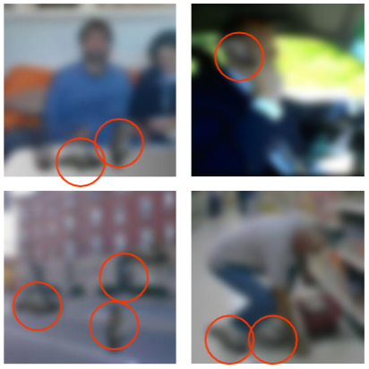

# Introduction to computer vision

## What is Computer vision?
* Using computers to understand contents image and video data acquired from the real world.

## essentially it:
* computes properties of the 3D world from visual data (measurements)
* Creates algorithms and representations to allow a machine to recognise objects, people, scenes activities. (perception and interpretation)

It relates to many disciplines:

## Online reading:

* [Computer Vision:  Algorithms and Applications](http://szeliski.org/Book/drafts/SzeliskiBook_20100903_draft.pdf "Richard Szeliski.  Computer Vision:  Algorithms and Applications.  Springer.  2010")

* [Computer Vision:  Models, Learning, and Inference](http://web4.cs.ucl.ac.uk/staff/s.prince/book/book.pdf "Simon J. D. Prince.  Computer Vision:  Models, Learning, and Inference.  Cambridge University Press.  2012")

* [Sussex Computer Vision texh files](http://users.sussex.ac.uk/~davidy/teachvision/vision0.html "David Young")

## Uses:
* broad

    * Relieve humans of boring, easy tasks

    * Human-computer interaction

    * Perception for robotics / autonomous agents

    * Organize and give access to visual content

* specific:
    * determining depth in image and video is an interesting one (vision for measurement)

    * Perception and interpretations of images - determining what is a car in an image, what is a person, a tree etc.

    * Faces and digital cameras - waiting for you to smile before it takes a photo. 
    Huawei have a feature to edit to depth of field after the photo was taken as post processing.
    Lighting on faces may be changed when the photo is taken to make sure the face is well lit

    * Face recognition - essentially assigning identity to someone

    * photo collections - determining where a photo was taken

    * special effects - using mocap (mocap suits)

    * medical imaging - image guided surgery.

## Problems that add to the difficulty of Computer Vision:

* Illumination (light)

* object pose

* clutter

* oclussions (light)

* Intra-class appearance (variation)

* Viewpoint

## Variation:
* chairs may look different. A desk chair looks different from a recliner.

Context is important:

