# Basic Operations on Images

## Images as Arrays
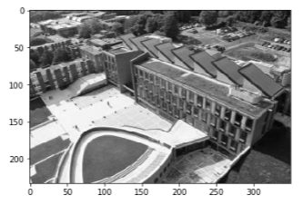

    print(image.shape) = (233, 350)
- From the shape we can see that the image contains 233 rows and 350 columns

---

## Basic statistics with images
- These can be useful for white balance and scene detection.    
    
      np.max(image) = 255
      np.min(image) = 3.0
      np.mean(image) = 122.06
      np.std(image) = 64.61
- Remember there is an **"axis="** option for these functions.
    - This is useful for selecting colour channels and averaging over them. 

- np.std calculates the standard deviation. This is how much the image strays from the mean.

---

## Data scaling
- It can be useful to rescale the intensities of the pixels into a fixed range. e.g. 0 or 1. 
- We do this because want data to have a common scale.
- This is used in the pre-processing step

---

## calculating statistics
- statistics can be calculated on patches of an image.

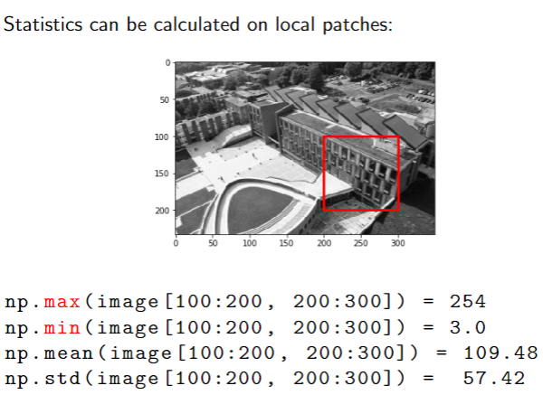

---

## Histograms:
- Provide a useful way to understand your data

- In histograms we split our data into bins.
- Bins are just a range of values.

e.g. For colour, if our image has pixels that lay between 0-255. If our bin is 0-30. Any pixel between 0 and 30 is part of that bin.

---

## Using a histogram:

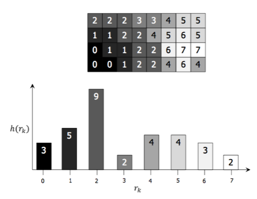

    plt.hist(img_gray.flatten(), normed=True, bins=10)

**flatten()** makes your numpy image array 1 dimensional. histograms expect 1 dime

Here, **normed** makes your y axis the proportion of total pixel counts rather than the actual number of pixels.

here, **bins** will make 10 bins of equal ranges.

---

## Histograms as features
- You can look at the pixel intensities in an image using histograms. This can tell you if there is a sky, if there is a sea etc. (pixel intensities are how dark a pixel is. HOW INTENSE IT IS)

Here, you can see how this might work:

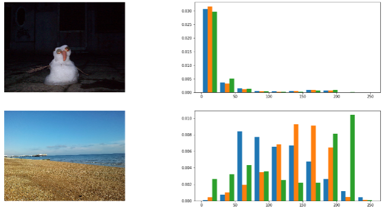

---

## Brightness

darker:
    
    plot_im_hist(img_gray / 2.0)

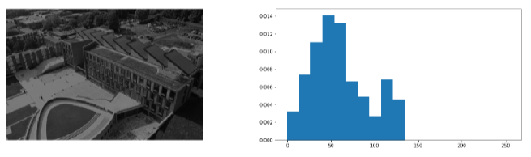

brighter:
    
    plot_im_hist(img_gray * 2.0)

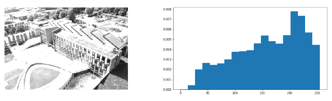

## contrast

- increase the standard deviation between pixels. This will increase the contrast

        plot_im_hist((img_gray - np.mean(img_gray)) * 2.0 + np.mean(img_gray))

This stretches out the pixels more.

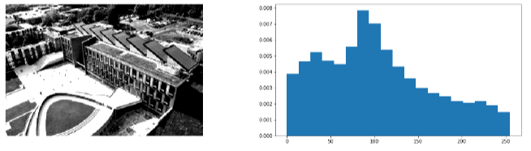

---

## plotting images next to each other.

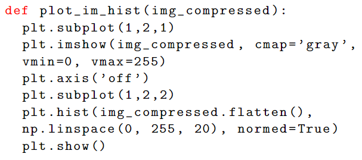

vmix/vmax will specify the range of pixels. To allow brightness to be edited without going out of its limit of 255

---

## Gamma correction
- In the first image more detail is visible in the bright part of the image
- In the second image more detail is visible in the dark part of the image.

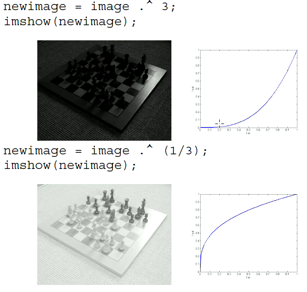

---

## Histogram equalisation

- Makes details more visible.
- Often used as pre-processing to highten details. (Can bring out details that were hidden before)

        cv2.equalizeHist

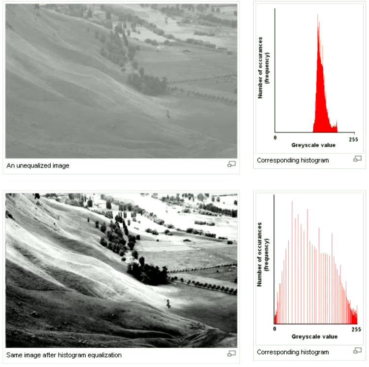

---

## Dynamic range
- This represents the most and least amount of light in an image.
- In photography, this is known as the range of luminance.

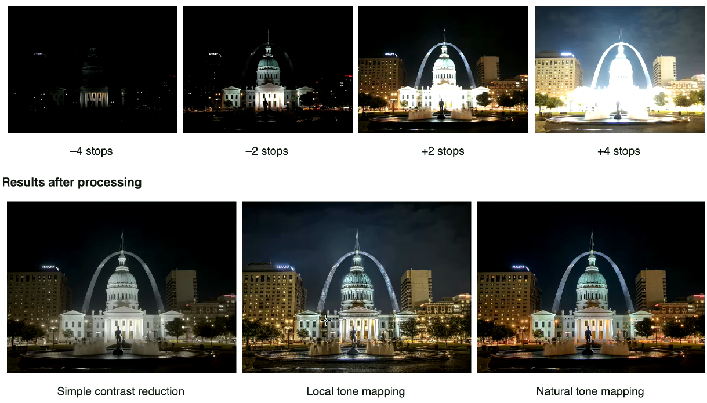

---

## LAB (luminance)
- A colour space that gives you better distictions between colour and brightness.

#### RGB VS LAB

**LAB**

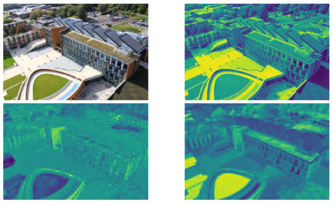

**RGB**

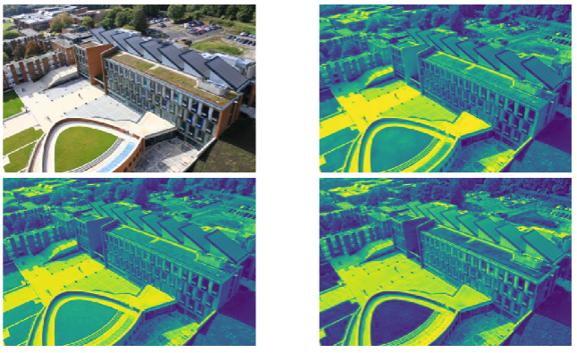

In the examples provided, there is a clear difference between these two colour spaces. 

---

## Hyperspectral images:
- An RBG camera devides the light spectrum into **broad** overlapping red, green, and blue image slices, that look realistic when combined.
- A hyperspectral camera devides
the colour spectrum into many **thin** image slices.

examples:

Detecting a persons hand by their veins:

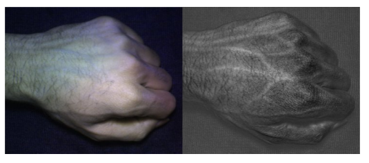

How ripe a fruit is:

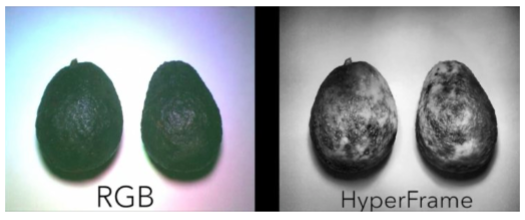

Examples of image slices:

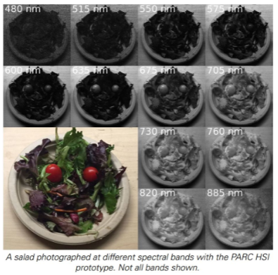
       
