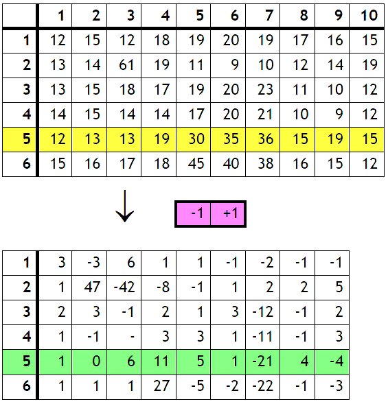
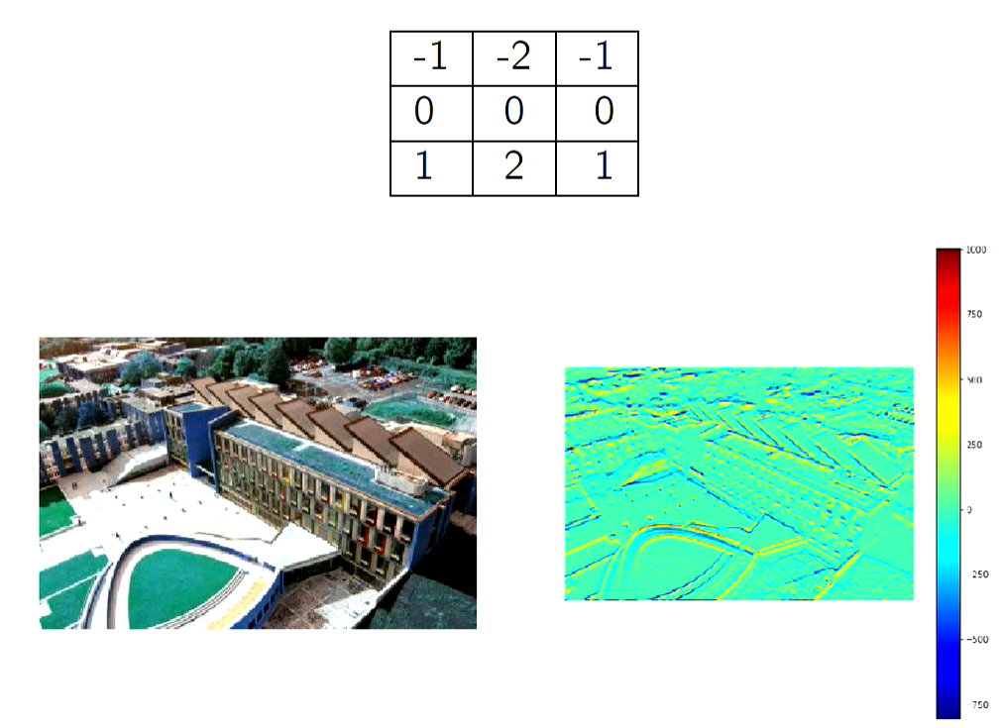

# Convolutions Part 1

## what are convolutions:
Applying a function on local parts of an image.
    - These functions are performed on "neighbourhoods"

- Used widely in computer vision
- Said to be similar to the way humans see images.

## uses:
- Edge detection
- Image denoising
- Edge enhancement/sharpening
- Object localisation

## Edge detection with convolutions:
To do this we use a template [-1, +1] when doing our convolution. A template is the calculation we will perform on each neighbourhood.
- this will calculate the horizontal edges.

#### Calculating the convolutions:

#### Outputs:

## Sobel filter:
- An edge detection method that removes edge noise.
- Edges will be more prominant and more details will show.

#### Sobel filter vs our edge detection:

(Sobel filter on the right!)

#### using scipy to do sobel filtering:

        from scipy.signal import convolve2d

        sobel_x_kernel = [[-1, 0, +1], [-2, 0, +2], [-1, 0, +1]]

        sobel_x_img = convolve2d(img_gray, sobel_x_kernel, 'same')

## sobel filter edge detection in y axis:

## Averaging filter

- We can smooth out image noise by performing a weighted average using convolutions.

## Odd numbered filters:
- This will give you a natural center point.

## Origin
- this is often the center pixel.
- When a filter is even. The center is often inbetween pixels. This means that the origin point must be chosen to be slightly to the left or right.
- It will affect how you move your kernel around the image.

## convolution formula:

The "*" here refers to the convolutional operation.

## Array boundaries
- At the end and start of the array(the boundaries), you have to make sure you have values that you can use.
- An edge pixel is missing a neighbouring pixel 
- You must substitute a value here in order to perform the convolutions.

#### methods to deal with this:

- You can make the output array smaller than the input array and miss a few rows and columns so that the mask never goes over the edge of the input array.

- "Wrap around" the input array so that the right edge joins the left and the top joins the bottom. (This is normally not a good idea)

- assume the input array is surrounded by zeros.

- assume that the image edge column is repeated as many times as necessary.

- assume that outside of the boundaries are reflections of the image.

